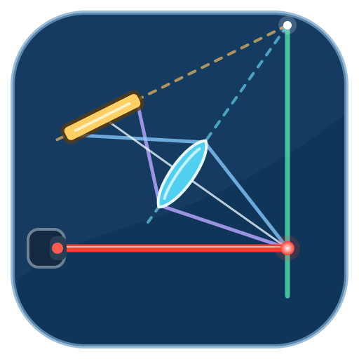

<p align="center">
  
</p>

<h1 align="center">Scheimpflug OptiMeter</h1>

`구조설계_rev.1.xlsx`에서 사용하던 입력·수식·결과를 Windows 데스크톱
화면으로 옮기고, 계산값에 따른 Scheimpflug 구조를 실시간으로 시각화하는
Python 3.12 시뮬레이터입니다.

이 프로그램의 범위는 광학 구조의 수치 계산과 2D/3D 시각화입니다.
카메라 검색·연결, 영상 획득, 보정, 레이저 중심선 검출 또는 실측 기능은
제공하지 않습니다. Basler 모델은 센서 크기와 픽셀 피치를 편리하게
불러오기 위한 정적 규격 프로파일일 뿐입니다.

논문은 수식과 광학 해석을 검토하기 위한 참고자료이며, 논문에 등장하는
실험 시스템 전체를 재현하지 않습니다. 제공된 논문과 원본 XLSX는 로컬
참고자료이므로 공개 저장소에 포함하지 않습니다.

## 주요 기능

- 워크북에서 추출한 `V, d, L, α` 입력과 계산식 재현
- 모든 입력의 한글명·수식 변수·단위 안내와 모드별 핵심 수식 카드
- 사용자 `L` 직접 입력 및 한 행 CSV 가져오기·계산 결과 내보내기
- 입력 즉시 갱신되는 레이저 조사 직선, 워킹 디스턴스, 렌즈 평면,
  광축, 이미지/센서 평면과 Scheimpflug 교점
- `β`, `b`, `x=L/2`, `W`, `R`, `fp`, `lo`, `s`, `f`, `lo+fp` 수치 표시
- 동일 축척을 유지하는 확대·이동·전체 맞춤과 SVG/PNG 내보내기
- 카메라·렌즈·센서 형상, 광학 평면·교선과 단일 레이저 조사 직선을
  문자 중첩 없이 구분하는 3D 시각화
- 창과 2D 뷰포트 크기에 따라 연속적으로 조절되는 반응형 글자 크기
- 정적 Basler 센서 규격 프로파일과 Edmund Optics M12 렌즈 규격 프로파일
- 같은 광학 조건에서 Basler 프로파일별 FOV, 물체측 샘플링과 기하학적
  거리 민감도를 비교하는 표
- 고급 비교용 canonical 계산 및 구조 최적화
- schema-v1 `.scheimpflug.json` 프로젝트 저장

기본 센서 프리셋인 `Basler ace acA1300-60gm`은 1282×1026, 5.3 µm,
6.7946×5.4378 mm 규격값만 제공합니다. 프로그램이 해당 장치에
접속하지는 않습니다.

## 빠른 실행

대상 환경은 Windows 10/11 x64이며 64비트 Python 3.12.10 이상이
필요합니다. Python 3.13은 지원하지 않습니다.

```powershell
uv sync --extra dev
uv run scheimpflug-optimeter
uv run pytest
```

`uv`를 사용하지 않을 경우:

```powershell
py -3.12 -m venv .venv
.\.venv\Scripts\python -m pip install -e ".[dev]"
.\.venv\Scripts\scheimpflug-optimeter.exe
```

첫 실행에는
[`examples/acA1300-60gm-12mm.scheimpflug.json`](examples/acA1300-60gm-12mm.scheimpflug.json)
샘플 프로젝트를 사용할 수 있습니다.

## Windows 단일 실행 파일

GitHub Release의 `Scheimpflug-OptiMeter-windows-x64.exe`를 내려받아
그대로 실행합니다. 압축 해제나 `_internal` 폴더가 필요하지 않으며,
Python이나 별도 장치 SDK·드라이버도 설치하지 않습니다.

단일 파일 패키지는 시작할 때 필요한 구성요소를 임시 폴더에 푸는 방식이라
첫 실행이 개발 환경보다 다소 느릴 수 있습니다. 릴리스에 함께 제공되는
`Scheimpflug-OptiMeter-windows-x64.exe.sha256`으로 실행 파일의
SHA-256을 확인할 수 있습니다. 자동 빌드 실행 파일은 코드 서명되지 않을
수 있으므로 Windows 보안 경고에서 게시자와 체크섬을 확인하십시오.

제품 버전은 대형 업데이트를 충분히 검토한 경우에만 신중하게 갱신합니다.
일상적인 수정과 소규모 기능도 릴리스에서 제외하지 않습니다. 이러한 변경은
제품 버전을 올리지 않고 고유 `build-YYYYMMDD.N` 유지보수 프리릴리스로
매번 배포합니다. 기존 태그와 릴리스 자산은 덮어쓰지 않습니다.

## 문서

- [Architecture](docs/architecture.md)
- [Optical formulas](docs/formulas.md)
- [Optimization](docs/optimization.md)
- [Static sensor and lens profiles](docs/hardware.md)
- [User guide](docs/user-guide.md)
- [Research references](docs/references.md)
- [Release policy](docs/release-policy.md)

## 규격 프로파일 주의사항

센서와 렌즈 프로파일은 시뮬레이션 입력을 빠르게 채우기 위한 참고값입니다.
마운트, 이미지 서클 및 외형 관련 경고도 계산상 비교 정보일 뿐 실제 장착이나
성능을 보증하지 않습니다. 부품을 구매하거나 기구를 가공하기 전에는 최신
제조사 도면을 확인해야 합니다.
